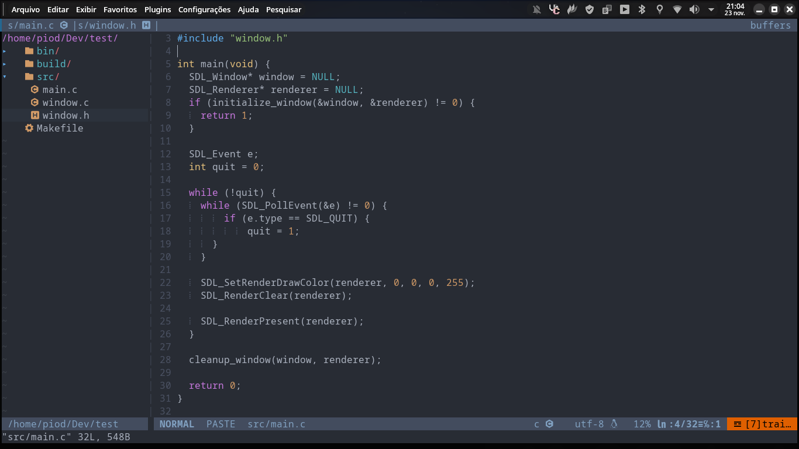

# Configuração do Vim

Este repositório contém uma configuração personalizada para o Vim, incluindo suporte a autocompletar, gerenciamento de arquivos e uma interface moderna.

## **Requisitos**
1. **Instalar o Vim**:
   - No Manjaro/Arch:
     ```bash
     sudo pacman -S vim
     ```

2. **Instalar o gerenciador de plugins `vim-plug`**:
   - Execute este comando para instalar:
     ```bash
     curl -fLo ~/.vim/autoload/plug.vim --create-dirs \
         https://raw.githubusercontent.com/junegunn/vim-plug/master/plug.vim
     ```

3. **Instalar dependências**:
   - Instale pacotes necessários como Python e Clang:
     ```bash
     sudo pacman -S python python-pip clang
     ```

4. **Compilar o YouCompleteMe**:
   - Após instalar os plugins com `:PlugInstall`, compile o YouCompleteMe:
     ```bash
     cd ~/.vim/plugged/YouCompleteMe
     python3 install.py --clangd-completer
     ```

---

## **Plugins Usados**
- **ayu-vim**: Tema escuro.
- **vim-airline**: Barra de status.
- **NERDTree**: Gerenciador de arquivos.
- **YouCompleteMe**: Autocompletar código.

---

## **Como Usar**
1. Copie o arquivo `.vimrc` para o seu diretório home.
2. Abra o Vim e execute `:PlugInstall` para instalar os plugins.
3. Aproveite sua nova configuração do Vim!

---

## **Atalhos**
- `<C-s>`: Salvar arquivo.
- `<C-e>`: Alternar NERDTree.
- `<Tab>`: Próximo buffer.
- `<C-w>`: Fechar buffer.

## Exemplo do Ambiente

Aqui está um exemplo do meu ambiente configurado no Vim:


